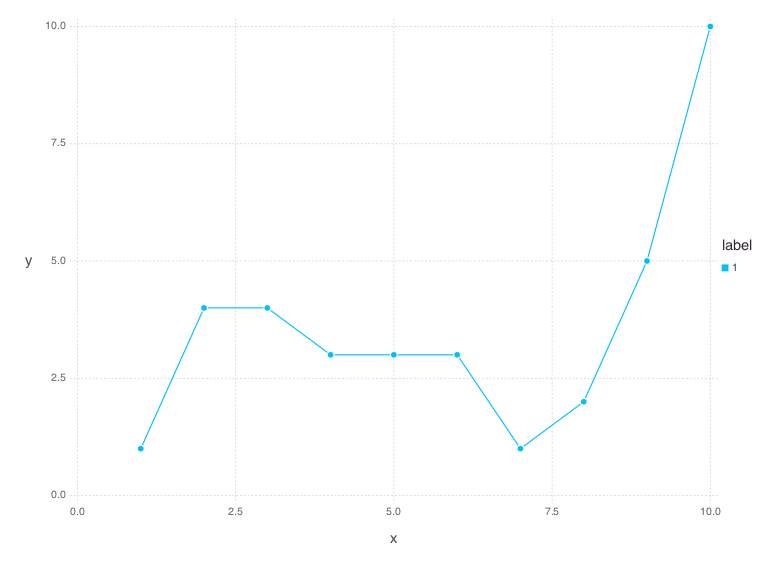

# FastViz.jl: A command-line interface in Julia to practical data visualization
<span style="float:right">v.0.2.0</span>
[](https://gitter.im/dmoliveira/fastviz.jl?utm_source=badge&utm_medium=badge&utm_campaign=pr-badge&utm_content=badge)
[](https://travis-ci.org/dmoliveira/fastviz.jl)
[](http://badge.fury.io/gh/dmoliveira%2Ffastviz.jl)

## 1. Introduction
`FastViz.jl` is a practical solution to plot simple and beautiful graphs at command-line. It was built entirely on [Julia language](http://julialang.org/) and uses [Gadfly](http://dcjones.github.io/Gadfly.jl/) package. I suggest to use with others powerful tools like `CSVKit` and `jq` as an input source to generate the graphs on-the-fly.

## 2. Installation

### 2.1. Install Script
The fast way to install `fastviz.jl` is to run `./install` at root directory of this project. It will check if you have Julia Language installed and linked to a `julia` alias at `/usr/local/bin`. If not, it will give you the right steps to achieve that. After it will install the Julia packages needed and create a symbolic link at `/usr/local/bin` with `fastviz.jl`. After the installation `fastviz.jl` can be called from any point of the terminal.

### 2.2. Julia Packages Dependencies
`fastviz.jl` uses only 2 packages listed below. It is installed automatically from the `install` script.

```
Pkg.add("Gadfly")
Pkg.add("Cairo")
```

## 3. Features
* Plot Histogram
* Plot Scatter Plot
* Plot Line
* Plot Smooth Curve
* Plot Boxplot
* Plot Rectbin
* Plot Hexbin
* Save plot in PNG format

## 4. Syntax Usage

```
fastviz.jl plot_type [output] serie1 [, serie2, ..., serieN]
```

### Arguments
- plot_type: Accept `Hist`, `Scatter`, `Line`, `Smooth`, `Boxplot` `Rectbin` and `Hexbin`.
- output (optional): Output name saved in PNG format.
- series: Input source used to plots. It can be a file or a number sequence separated by space.

## 5. Examples

### 5.1. Plot a Histogram
```
fastviz.jl Hist "1 4 5 3 3 5 1 2 5"
```


### 5.2. Plot a Scatter Plot
```
fastviz.jl Scatter "1 4 4 3 3 3 1 2 5 10" "5 5 5 1 2 2 6 7 7 7"
```


### 5.3. Plot a Line Plot
```
fastviz.jl Scatter "1 4 4 3 3 3 1 2 5 10"
```


### 5.4. Plot a Smooth Curve
```
fastviz.jl Smooth "1 3 3 4 4 4 1 2 5 10" "5 5 5 1 2 2 6 7 7 7"
```


### 5.5. Plot a Scatter with file as input source
```
fastviz.jl Scatter sample/iris-data-x.txt sample/iris-data-y.txt
```


### 5.6. Plot a Boxplot
```
fastviz.jl Boxplot sample/iris-data-x.txt sample/iris-data-y.txt
```


### 5.7. Plot a Rectbin
```
fastviz.jl Rectbin "1 2 3 4 5" "11 12 13 14 15" "21 22 23 24 25"
```


### 5.8. Plot a Hexbin
```
fastviz.jl Hexbin "$(seq 1 .1 4 | tr '\n' ' ')" "$(seq 1 .1 4 | tr '\n' ' ')"
```


### 5.9. A more complex usage case
In this example we'll show how combining this simple library with other unix tools can be powerful and achieve practical results in few minutes instead of a hour of making a script code.


First we'll get currency data from different countries using a REST API. Second we'll process this data and get only the related data of EUR x USD. At last we'll plot this data over August month using  smooth curve on `fastviz.jl`.

```
# 1. Get JSON data from September August
json=`parallel -j1  "curl -s -XGET http://api.fixer.io/2015-08-{1}" :::: <( seq -f %02g 1 31)`

# 2. Process Data: Get USD and BRL currency
USDxEUR=`echo $json | jq '.[].USD|select(length > 0)' | tr '\n' ' '`
BRLxEUR=`echo $json | jq '.[].BRL|select(length > 0)' | tr '\n' ' '`

# 3. Lets plot a Smooth Curve with 2 series (blue=UER, yellow=BRL)
plot.jl Smooth "$USDxEUR" "$BRLxEUR"
```


### 5.9. Input Source
Can accepts as input `File` or `NumberList`.

- File: A file with a list of numbers separated by new line.
        All files need to have extension (*i.e.*, .txt, .csv)
        and have only one data column per file.

        Example:

        102
        12
        54
        ...
        12
        251

- NumberList: A series of numbers separated by space and delimited by quote.
              Example:
              "1 24 50 23 130 40 54 12"

### 5.10. Plot Parameters
- Hist: Multiple series
- Scatter: Multiple pairs of series (X and Y series)
- Line: Multiple series
- Smooth: Multiple series
- Boxplot: Multiple series
- Recbin: Three series (Triple)
- Hexbin: Two series (Pair)

## 6. Notes
* For multiple series, the length of each one need to be the same.
* At output parameter ALWAYS add .png or the parameter will be interpreted as a series.
* During the execution

## 7. Contributions
Please send pull-requests or open issues on GitHub. Use Gitter to chat about this project. All are welcome.
